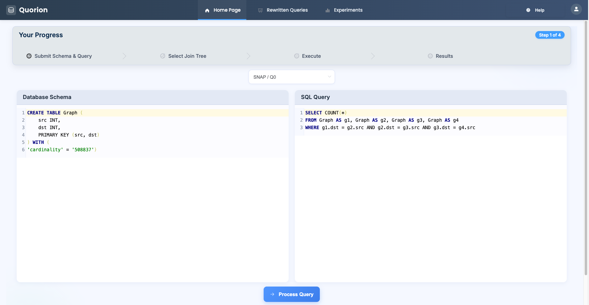
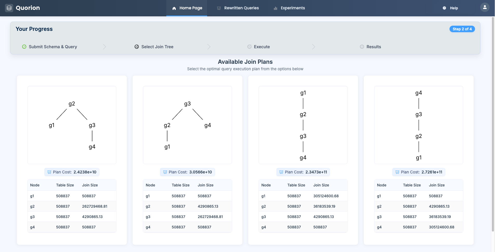
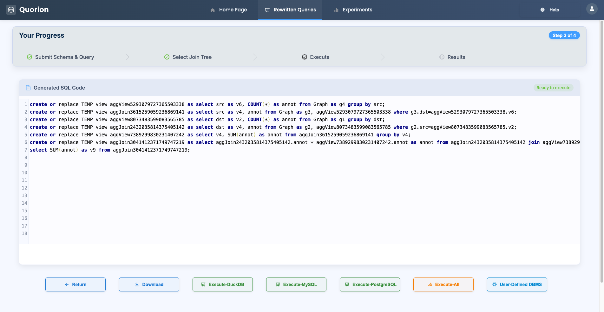
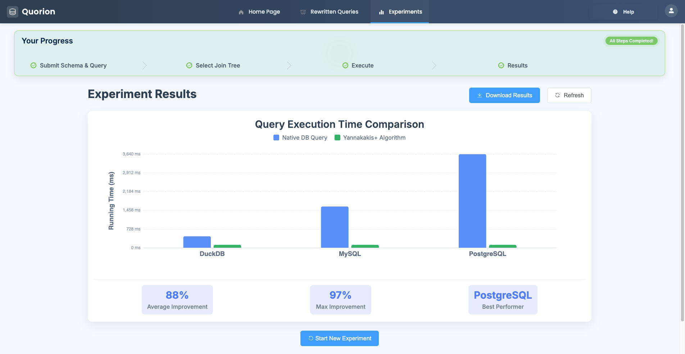

# Anonymous

## Quick Start (Automated Setup)

### Step0: Docker Setup (Recommended)
#### Preliminaries: Environment Requirements
- Java JDK 1.8
- Scala 2.12.10
- Maven 3.8.6
- Python version >= 3.9
- Python package requirements: docopt, requests, flask, openpyxl, pandas, matplotlib, numpy, argparse, pyarrow

We provide a Dockerfile to automatically set up the environment with all prerequisites (Java, Scala, Maven, Python, PostgreSQL, DuckDB).

```shell
cd anonymous
docker build -t anonymous-image .
docker run -it --rm -v /path/to/anonymous:/anonymous anonymous-image
```

**Python Environment Setup:**
```shell
# Create virtual environment (recommended)
$ python3 -m venv .venv
$ source .venv/bin/activate
$ pip install docopt requests flask openpyxl pandas matplotlib numpy

# Update config to use virtual environment
$ echo "python3.bin=$(pwd)/.venv/bin/python3" >> query/config.properties
```

**Configuration:**
Before running, you may customize settings in `query/config.properties`:
```properties
# Python environment (default or custom path)
python3.bin=python3

# Experiment settings
common.experiment.repeat=1
common.experiment.timeout=60
```


### Step1: Run

For a fully automated setup and execution of all experiments, use:

```shell
$ bash scripts/run_all.sh [LSQB_SCALE(defalut=1)] [TPCH_SCALE(defalut=1)]
```

This single script will:
1. Download and install DuckDB, PostgreSQL, and Spark
2. Download all datasets (Graph, LSQB, TPC-H, JOB)
3. Initialize databases and load data
4. Generate rewritten queries
5. Run all experiments (DuckDB, PostgreSQL, SparkSQL)
6. Generate summary statistics and plots
7. The final plot results will be under `draw/*.pdf`

---

## Paper-Scale Data Workflow
To run the paper scale workflow, follow these steps:

### Step1: Run Phase 1 script
Change the last line in `scripts/run_all_1.sh` to paper scale `bash scripts/download_data.sh 30 100`. Then execute the initial bash script:
```bash
bash scripts/run_all_1.sh
```

### Step 2: Add Jobs
Run the script with your desired CSV and Parquet paths:

```bash
# create folder /path/to/anonymous/Data/job/new/
mkdir -p Data/job/new
python3 scripts/addJob.py
bash script/generate_job_load.sh
```

This will process all tables and generate new Parquet files with updated IDs in the specified output path.

### Step3: Run Phase 2 script 
Execute the second bash script:
```bash
bash scripts/run_all_2.sh
```

---

## Manual Setup (Step-by-Step)

If you prefer manual setup or need to customize individual steps, follow the detailed instructions below.

## Part1: Reproducibility of the Experiments

### Step1: DBMS Requirement Preparation

#### DuckDB 1.0: 
0. Move into install directory. Do the following command:
1. Download *.zip or *.tar.gz file from https://github.com/duckdb/duckdb/releases/tag/v1.0.0 
2. Extract the content and generate duckdb executable file
```shell
# Step 0:
$ cd anonymous/query

# Step 1:
# duckdb_cli-linux-aarch64.zip
$ wget https://github.com/duckdb/duckdb/releases/download/v1.0.0/duckdb_cli-linux-aarch64.zip
    or
# duckdb_cli-linux-amd64.zip
wget https://github.com/duckdb/duckdb/releases/download/v1.0.0/duckdb_cli-linux-amd64.zip
    or 
# duckdb_cli-osx-universal.zip
wget https://github.com/duckdb/duckdb/releases/download/v1.0.0/duckdb_cli-osx-universal.zip
    or
# duckdb_cli-windows-amd64.zip
wget https://github.com/duckdb/duckdb/releases/download/v1.0.0/duckdb_cli-windows-amd64.zip

# Step 2:
unzip duckdb_cli-*.zip
```

#### PostgreSQL 16.2
0. Change directory to any directory that you want to install your PostgreSQL
1. Install PostgreSQL 16.2. 
```shell
# 1. Download 
$ wget https://ftp.postgresql.org/pub/source/v16.2/postgresql-16.2.tar.gz
$ tar -xvzf postgresql-16.2.tar.gz 
$ cd postgresql-16.2
# 2. Build
$ ./configure --prefix=/path/to/postgresql-16.2
$ make -j
$ make install
$ mkdir data
# 3. Set environment
$ export PGDATA=/path/to/postgresql-16.2/data
$ export PATH=/opt/pgsql16/bin:$PATH
# 4. Initialization
$ initdb -D $PGDATA -E UTF8 --locale=C -U postgres
# 5. Start pg server
$ bin/pg_ctl -D $PGDATA -l logfile start
```
2. Create a database `test`. You may use another name for the database.
```shell
# 6. Create test database
$ createdb -U postgres test
# 7. Check
$ bin/psql -U postgres test
  # Show
  test=#
```
3. Make sure you can access the database by `/path/to/postgresql-16.2/bin/psql -U postgres -d test` (without a password)
4. Install extension after access the database by using command `CREATE EXTENSION file_fdw;`. If executing the command failed, executing the following commands. 
```shell
$ cd /path/to/postgresql-16.2/contrib/file_fdw
$ make
$ make install
$ /path/to/postgresql-16.2/bin/pg_ctl -D /path/to/data stop
$ /path/to/postgresql-16.2/bin/pg_ctl -D /path/to/data start
$ /path/to/postgresql-16.2/bin/psql -U postgres -d test
test=# CREATE EXTENSION file_fdw;
```

#### Spark 3.5.1
**Automated Installation (Recommended):**
```shell
$ bash scripts/run_spark.sh
# Spark will be automatically downloaded to anonymous/spark/spark-3.5.1/
```

### Step2: Dataset Download
Generate datasets: Graph, LSQB, TPCH, JOB. 

```shell
$ bash scripts/download_data.sh [LSQB_SCALE] [TPCH_SCALE]

# Examples:
# Default (LSQB=3, TPCH=10)
bash scripts/download_data.sh

# LSQB=1, TPCH=1
bash scripts/download_data.sh 1 1
```

Notes:
- If `zstd` is not available, the script falls back to a user‑space Python extractor.
- Python fallback: ensure a working Python 3. If your interpreter is not `python3`, set `PY_BIN` in `scripts/download_data_lsqb.sh` (around line 41) to the correct Python path, or let the script create a local venv and install `zstandard` automatically.

### Step3: Database Initialization
1. Replace the default path in `load_[graph|lsqb|tpch|job]_[duckdb|pg].sql` by running the command below.
```shell
$ bash scripts/update_paths.sh
```
2. Copy the file `query/config.properties.template` and rename it as `query/config.properties`. Change the settings in `query/config.properties` to set the corresponding PostgreSQL config and DuckDB config. 
```properties
# Python environment
python3.bin=python3

# PostgreSQL config
pg.db=test
pg.port=5434
pg.path=/path/to/postgresql/bin/psql

# DuckDB config
duckdb.path=/path/to/duckdb

# Experiment config
common.experiment.repeat=5
common.experiment.timeout=7200

# Parser config
parser.mode=local
parser.home=/path/to/anonymous/SparkSQLPlus
```
3. Then load data to the DuckDB and PostgreSQL by the following commands. 
```shell
$ bash scripts/load_data_duckdb.sh
$ bash scripts/load_data_pg.sh
```

### Step4: Generate rewritten queries
#### Option1: Use the generated rewritten queries
- Go to Step5 directly. 
#### Option2: Generate rewritten queries by yourself
1. Build jar file. 
```shell
$ git submodule init
$ git submodule update
$ cd SparkSQLPlus
$ mvn clean package
$ cp sqlplus-web/target/sparksql-plus-web-jar-with-dependencies.jar ../
```
2. Change the `Parser config` at `query/config.properties`. 
3. Start parser using command 
```shell
$ bash ./scripts/start_parser.sh
```
4. Execute main.py to launch the Python backend rewriter component.
```shell
$ python3 main.py
```
5. Generate rewritten queries for DuckDB SQL syntax. 
```shell
./auto_rewrite.sh graph graph_duckdb D N
./auto_rewrite.sh graph graph_pg M N
./auto_rewrite.sh lsqb lsqb D N
./auto_rewrite.sh tpch tpch D N
./auto_rewrite.sh job job D N
```

### Step5: Run experiments

#### DuckDB and PostgreSQL Experiments

**Run all experiments:**
```shell
$ cd query
$ bash auto_run_duckdb_batch.sh
$ bash auto_run_pg_batch.sh
```

**Or run benchmarks separately:**
```shell
# Run DuckDB
$ bash auto_run_duckdb.sh graph graph_duckdb
$ bash auto_run_duckdb.sh lsqb lsqb
$ bash auto_run_duckdb.sh tpch tpch
$ bash auto_run_duckdb.sh job job

# Run PostgreSQL
$ bash auto_run_pg.sh graph_pg
$ bash auto_run_pg.sh lsqb
$ bash auto_run_pg.sh tpch
$ bash auto_run_pg.sh job
```

**Parallelism testing:**
```shell
$ bash auto_run_duckdb.sh parallelism_lsqb [1|2|4|8|16|32|48]
$ bash auto_run_duckdb.sh parallelism_sgpb [1|2|4|8|16|32|48]

# Example: Test LSQB with different thread counts
$ bash auto_run_duckdb.sh parallelism_lsqb 1
$ bash auto_run_duckdb.sh parallelism_lsqb 2
$ bash auto_run_duckdb.sh parallelism_lsqb 4
$ bash auto_run_duckdb.sh parallelism_lsqb 8
$ bash auto_run_duckdb.sh parallelism_lsqb 16
$ bash auto_run_duckdb.sh parallelism_lsqb 32
$ bash auto_run_duckdb.sh parallelism_lsqb 48
```

**Scale and selectivity testing:**
- Scale testing queries: `query/scale_[job|lsqb]`
- Selectivity testing queries: `query/selectivity_[lsqb|tpch]`

#### SparkSQL Experiments

**Automated setup and execution:**
```shell
$ bash scripts/run_spark.sh
```

This script will:
- Automatically download and install Spark 3.5.1 (if not present)
- Create soft links for datasets with proper naming
- Build SparkSQL Runner
- Configure Spark settings
- Run all benchmarks (Graph, LSQB, TPC-H, JOB)
- Extract and summarize query execution times

**Manual execution:**
For manual setup and execution details, refer to [SparkSQLRunner/README.md](SparkSQLRunner/README.md).

### Step6: Generate Results and Plots

1. Execute the following commands to gather statistics. The generated statistics are saved in `summary_*_statistics[_default].csv`. 
```shell
# Gather results for query under directory graph & lsqb & tpch & job
$ bash auto_summary.sh graph
$ bash auto_summary.sh lsqb
$ bash auto_summary.sh tpch
$ bash auto_summary_job.sh job
```

2. Execute scripts under `draw/` to generate plots. Generated figures are saved as `draw/*.pdf`. 
```shell
$ cd draw

# Generate pictures (graph.pdf, lsqb.pdf, tpch.pdf) about running times for SGPB, LSQB and TPCH
# Corresponding to Figure 9
$ python3 draw_graph.py

# Generate pictures (job_duckdb.pdf, job_postgresql.pdf) about running times for JOB
# Corresponding to Figure 10
$ python3 draw_job.py

# Generate picture (selectivity_scale.pdf) about selectivity & scale
# Corresponding to Figure 11
$ python3 draw_selectivity.py

# Generate pictures (thread1.pdf, thread2.pdf) about parallelism
# Corresponding to Figure 12
$ python3 draw_thread.py
```

---

## Automated vs Manual Setup

| Aspect | Automated (`scripts/run_all.sh`) | Manual (Step-by-Step) |
|--------|----------------------------------|------------------------|
| **Setup Time** | ~10-30 minutes | ~1-2 hours |
| **Customization** | Limited | Full control |
| **Dependencies** | Auto-installed | Manual installation |
| **Error Handling** | Automated fallbacks | Manual debugging |
| **Use Case** | Quick reproducibility | Custom configurations |

**Recommendation:**
- Use `scripts/run_all.sh` for initial setup and full reproducibility
- Use manual steps for customization, debugging, or partial re-runs

---

### File Structure

```shell
anonymous/
├── README.md
├── Dockerfile                        # Container setup for all dependencies
├── *.py                              # Python backend rewriter components
├── sparksql-plus-web-jar-with-dependencies.jar  # Java parser jar file
├── SparkSQLRunner/
│   ├── README.md
│   ├── Data/                         # Soft-linked dataset directory
│   ├── Query_graph/                  # Graph queries for Spark
│   ├── Query_lsqb/                   # LSQB queries for Spark
│   ├── Query_tpch/                   # TPC-H queries for Spark
│   ├── Query_job/                    # JOB queries for Spark
│   ├── Schema/                       # Schema files
│   ├── log/                          # Execution logs
│   │   └── summary/                  # Extracted query times (CSV)
│   └── config.properties             # Spark configuration
├── SparkSQLPlus/                     # Git submodule for Java parser
├── spark/                            # Auto-installed Spark directory
│   └── spark-3.5.1/                  # Spark installation
├── Data/                             # Dataset directory (created by scripts)
│   ├── graph/                        # Graph dataset
│   ├── lsqb/                         # LSQB dataset
│   ├── tpch/                         # TPC-H dataset
│   └── job/                          # JOB dataset
├── query/                            # Query and execution scripts
│   ├── config.properties.template    # Configuration template
│   ├── config.properties             # User configuration
│   ├── common.sh                     # Common shell functions
│   ├── load_graph_duckdb.sql         # Graph data loading for DuckDB
│   ├── load_graph_pg.sql             # Graph data loading for PostgreSQL
│   ├── load_lsqb_duckdb.sql          # LSQB data loading for DuckDB
│   ├── load_lsqb_pg.sql              # LSQB data loading for PostgreSQL
│   ├── load_tpch_duckdb.sql          # TPC-H data loading for DuckDB
│   ├── load_tpch_pg.sql              # TPC-H data loading for PostgreSQL
│   ├── load_job_duckdb.sql           # JOB data loading for DuckDB
│   ├── load_job_pg.sql               # JOB data loading for PostgreSQL
│   ├── auto_run_duckdb.sh            # DuckDB execution script
│   ├── auto_run_pg.sh                # PostgreSQL execution script
│   ├── auto_run_duckdb_batch.sh      # Batch DuckDB execution script
│   ├── auto_run_pg_batch.sh          # Batch PostgreSQL execution script
│   ├── graph/                        # Graph queries
│   ├── lsqb/                         # LSQB queries
│   ├── tpch/                         # TPC-H queries
│   ├── job/                          # JOB queries
│   ├── parallelism_lsqb/             # Parallelism test queries (LSQB)
│   ├── parallelism_sgpb/             # Parallelism test queries (SGPB)
│   ├── scale_job/                    # Scale test queries (JOB)
│   ├── scale_lsqb/                   # Scale test queries (LSQB)
│   ├── selectivity_lsqb/             # Selectivity test queries (LSQB)
│   ├── selectivity_tpch/             # Selectivity test queries (TPC-H)
│   ├── summary_*_statistics.csv      # Generated statistics files
│   └── summary_*_statistics_default.csv  # Default/fallback statistics
├── draw/                             # Visualization scripts and outputs
│   ├── draw_graph.py                 # Generate Figure 9 (SGPB, LSQB, TPCH)
│   ├── draw_job.py                   # Generate Figure 10 (JOB performance)
│   ├── draw_selectivity.py           # Generate Figure 11 (selectivity & scale)
│   ├── draw_thread.py                # Generate Figure 12 (parallelism)
│   ├── graph.pdf                     # Visualization output
│   ├── lsqb.pdf                      # Visualization output
│   ├── tpch.pdf                      # Visualization output
│   ├── job_duckdb.pdf                # Visualization output
│   ├── job_postgresql.pdf            # Visualization output
│   ├── selectivity_scale.pdf         # Visualization output
│   ├── thread1.pdf                   # Visualization output
│   └── thread2.pdf                   # Visualization output
├── scripts/                          # Utility scripts
│   ├── run_all.sh                    # **One-command setup and execution**
│   ├── run_spark.sh                  # Automated SparkSQL setup and execution
│   ├── update_paths.sh               # Update data paths in SQL files
│   ├── load_data_duckdb.sh           # Unified data loader for DuckDB
│   ├── load_data_pg.sh               # Unified data loader for PostgreSQL
│   ├── download_data.sh              # Download all datasets
│   ├── download_data_graph.sh        # Download graph dataset
│   ├── download_data_lsqb.sh         # Download LSQB dataset
│   ├── download_data_tpch.sh         # Download TPCH dataset
│   ├── download_data_job.sh          # Download JOB dataset
│   └── start_parser.sh               # Parser startup script
├── auto_rewrite.sh                   # Query rewriting script
├── auto_summary.sh                   # Results summary script
├── auto_summary_job.sh               # JOB results summary script
└── figure/                           # Documentation figures
    ├── 1.png
    ├── 2.png
    ├── 3.png
    └── 4.png
```

---

## Part2: Extra Information [Optional]

### Structure Overview
- Web-based Interface
- Java Parser Backend
- Python Optimizer & Rewriter Backend

### Preprocessing [Optional]

#### Statistics Generation
For generating new statistics (`cost.csv`), we offer the DuckDB version scripts `query/preprocess.sh` and `query/gen_cost.sh`. 

```shell
# Modify configurations and execute
$ cd query
$ bash preprocess.sh
$ bash gen_cost.sh
```

For web-ui: Move generated statistics files to folders `graph/q1/`, `tpch/q2/`, `lsqb/q1/`, `job/1a/`, and `custom/q1/` respectively.

For command-line: Move them to the specific corresponding query folders.

#### Plan Conversion
We also provide conversion of DuckDB plans. Modify the DuckDB and Python paths in `gen_plan.sh`:

```shell
$ bash gen_plan.sh ${DB_FILE_PATH} ${QUERY_DIRECTORY}

# Example:
$ bash gen_plan.sh ~/test_db job
```

After running:
- Original DuckDB plan: `db_plan.json`
- Converted plan: `plan.json` (suitable for our parser)

**Note:** Change `timeout=0` in `requests.post` at `main.py:223` if you want to use self-defined plans.

### Execution Modes

We provide two execution modes (modify `EXEC_MODE` at line 767 in `main.py`):

#### 1. Web-UI Mode (Default)

```shell
# Start Python backend
$ python3 main.py

# Start Java parser (in another terminal)
$ java -jar sparksql-plus-web-jar-with-dependencies.jar

# Open browser
$ open http://localhost:8848
```

#### 2. Command Line Mode

```shell
# Start parser
$ bash scripts/start_parser.sh

# Generate rewritten queries
$ bash auto_rewrite.sh ${DDL_NAME} ${QUERY_DIR} [MODE] [YANNAKAKIS_FLAG]

# Examples:
$ bash auto_rewrite.sh lsqb lsqb D N     # DuckDB syntax, Yannakakis-Plus
$ bash auto_rewrite.sh graph graph_pg M N # MySQL syntax, Yannakakis-Plus
$ bash auto_rewrite.sh tpch tpch D Y     # DuckDB syntax, Yannakakis
```

**Options:**
- `MODE`: D (DuckDB) or M (MySQL) [default: D]
- `YANNAKAKIS_FLAG`: Y (Yannakakis) or N (Yannakakis-Plus) [default: N]

**For single query execution:**
Modify `init_global_vars` function in `main.py`:
- Uncomment lines 587-589 (single query section)
- Comment lines 610-629 (auto-rewrite section)

### Web UI Demonstration

#### Step 1: Upload Query


#### Step 2: View Parsed Plan


#### Step 3: Optimize Query


#### Step 4: Execute and View Results


---

## Troubleshooting

### Parser Management
```shell
# Find parser process
$ jps | grep jar

# Kill parser
$ kill <PID>
```

### Query Requirements
- For queries with `SELECT DISTINCT ...`, remove the `DISTINCT` keyword before parsing
- Ensure all table and column names match the schema definitions

### Configuration Issues
- If experiments fail, verify `query/config.properties` settings
- Check that all paths in config are absolute and correct
- Ensure PostgreSQL is running: `pg_ctl status -D /path/to/data`

### Python Environment
```shell
# Verify Python version
$ python3 --version  # Should be >= 3.9

# Verify packages
$ python3 -c "import docopt, requests, flask, openpyxl, pandas, matplotlib, numpy"

# If missing packages
$ pip install docopt requests flask openpyxl pandas matplotlib numpy
```

---
